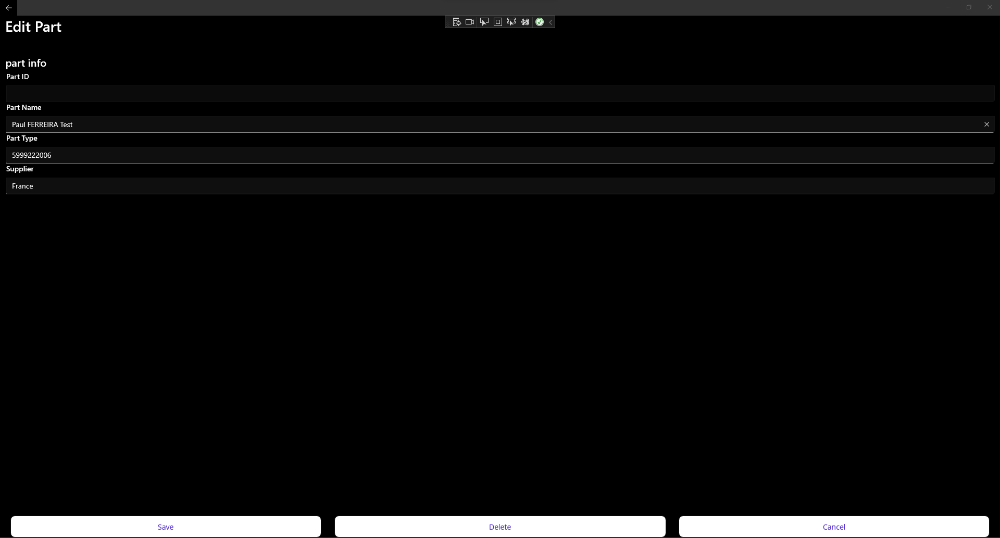
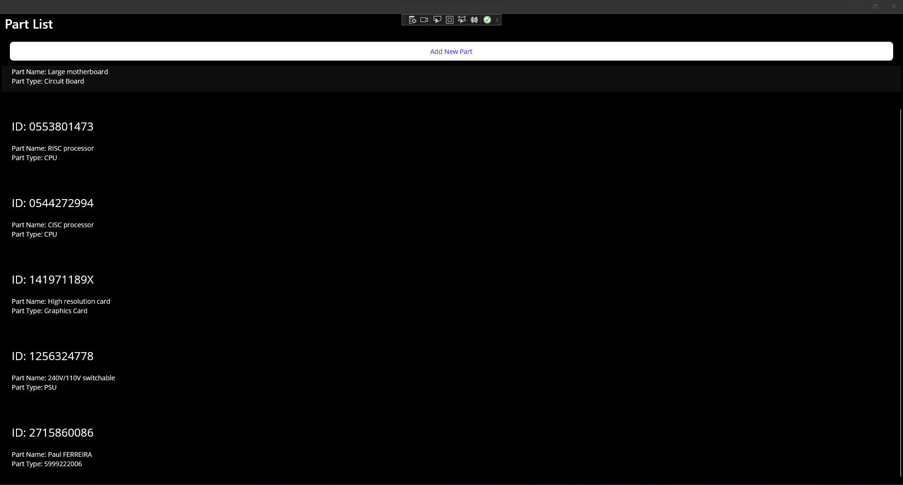
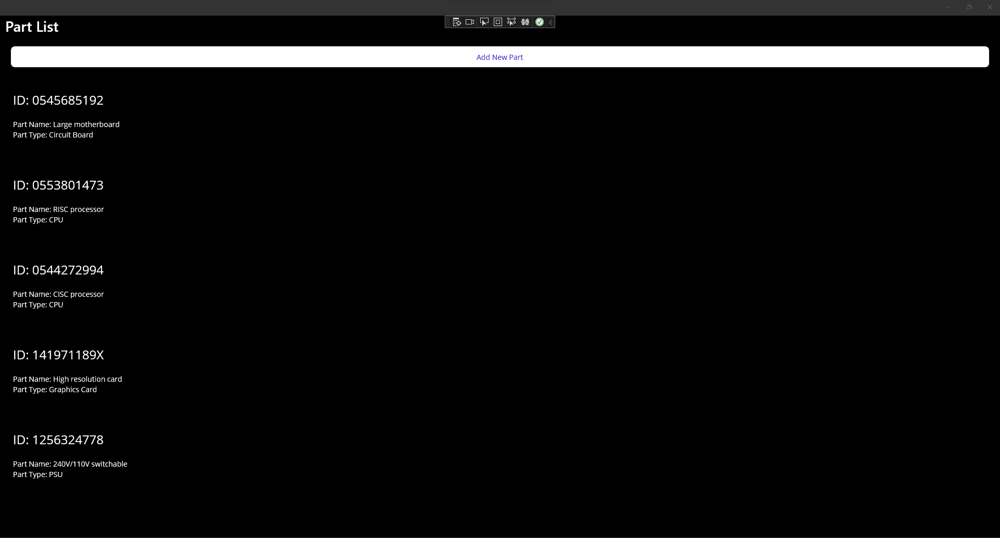
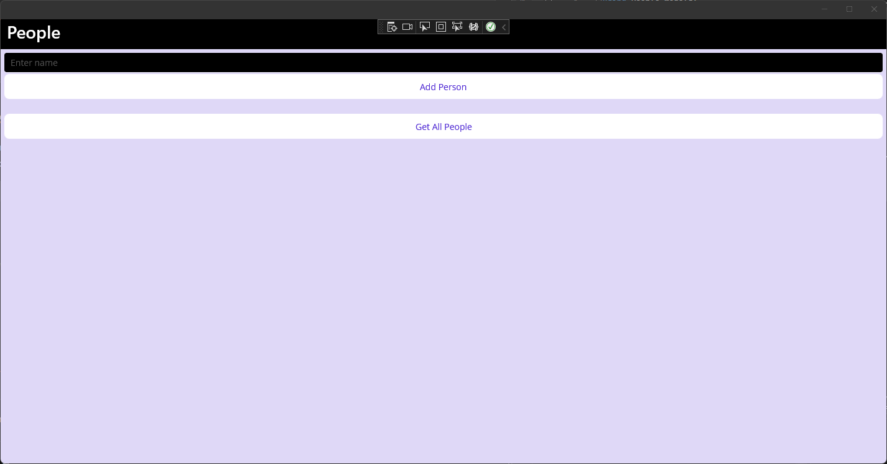
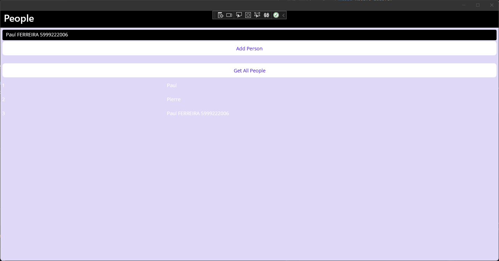

Paul FERREIRA - 5999222006

Exercice 1:

After Updating:

After deleting :

Exercice 2:

We see that we can modifed the database with an asynchronous way.

Thank you for watching,

Paul FERREIRA.
